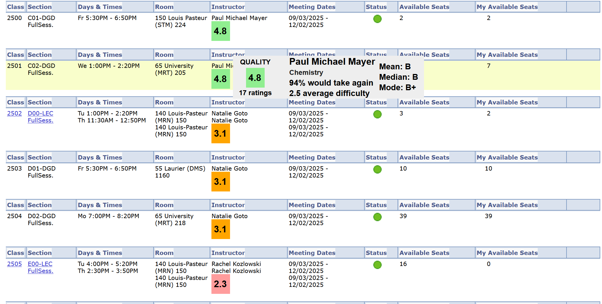

# University of Ottawa - Rate my Professor
UO-RMP is a web extension that conveniently places a professor's [Rate my Professor](https://www.ratemyprofessors.com) rating beside their name when enrolling for classes on UOZone. Hovering over the rating will reveal more stats from Rate my Professor, such as number of ratings and difficulty level.

<p align="center">
  </img>
</p>

## Downloads
* [Firefox](https://addons.mozilla.org/en-US/firefox/addon/uo-rate-my-prof/)
* [Chrome (manual install)](#installing-on-chrome)
* [Edge (manual install)](#installing-on-edge)

Note: The extension could theoretically work on Safari, but hasn't been tested.

## Installing on Chrome
1. Download the UO-RMP-Chrome.zip file from [the downloads page](https://www.github.com/supercam19/uo-rmp/releases/latest).
2. On your computer, unzip the downloaded zip file.
3. In Chrome, type `chrome://extensions` into the address bar
4. Enable developer mode in the top right of the page
5. Press the `Load unpacked` button in the top left, and select the folder you unziped in step 2. The extension is now loaded.

## Installing on Edge
1. Download the UO-RMP-Chrome.zip file from [the downloads page](https://www.github.com/supercam19/uo-rmp/releases/latest).
2. On your computer, unzip the downloaded zip file.
3. In Edge, press the extensions button at the top and press `Manage extensions`
4. Enable developer mode in the left panel of the page
5. Press the `Load unpacked` button, and select the folder you unziped in step 2. The extension is now loaded.

## Build the project
Clone the repo, and in the cloned directory
```
npm install
npm run build
```
The built extension is in the `dist` directory.
